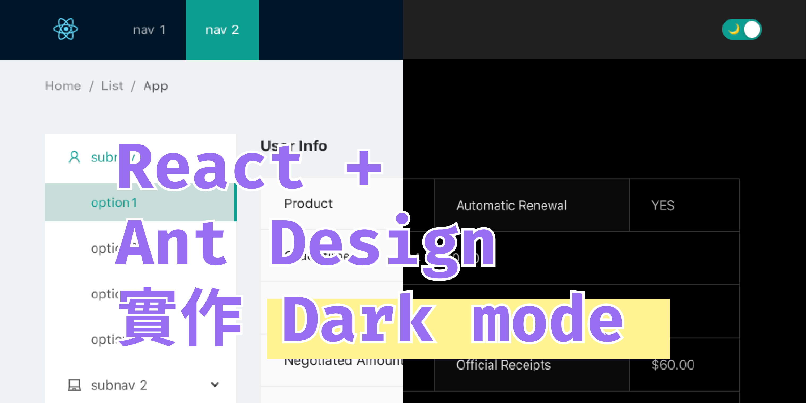
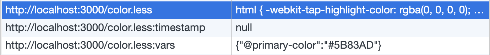
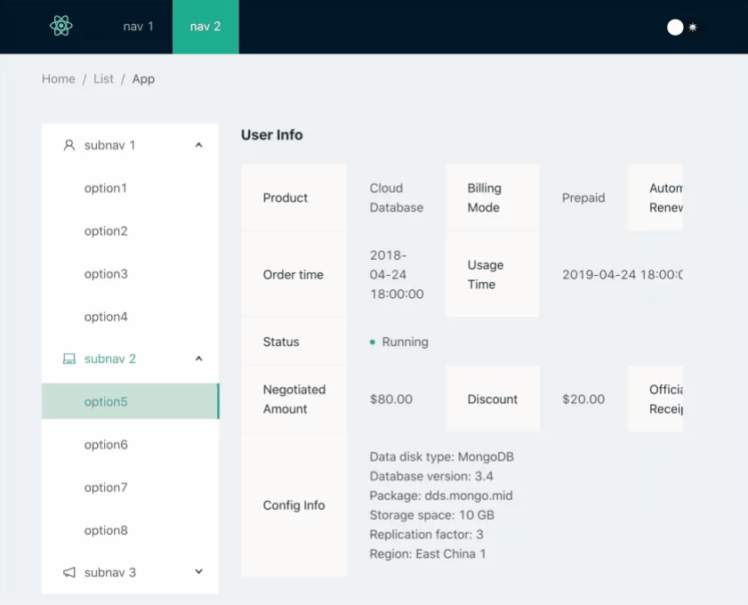

一開始在找 Dark theme 相關文章，都只有找到如何改成 Ant Design dark theme，或是像 [官網](https://ant.design/docs/react/customize-theme) 客製化 theme，比較少有提到我想要的可以 **動態切換 theme 的功能**

雖然也可以使用 `styled-component` 配上自己寫的 theme.js，不過有找到套件可以不用透過 `styled-component` 想說就來試試看吧，最後也有完成

這邊稍微紀錄一下實作的過程及步驟

## 1. setup 建置專案

先從建置專案開始

```jsx
npx create-react-app dark-theme
```

安裝 Ant design

```jsx
yarn add antd
```

記得 App.css 要引入 antd 的 css

```jsx
/* App.css */
@import "~antd/dist/antd.css";
```

### 2. Webpack 調整

因為需要修改 Webpack config，又因為我們使用 `creat-react-app` 建置， `webpack.config.js` 被放到 `react-script` 下的 config 裡

所以要先載 [react-app-rewired](https://github.com/timarney/react-app-rewired#readme) ，package.json 也需要改指令

```jsx
/* package.json */

"scripts": {
    "start": "react-app-rewired start",
    "build": "react-app-rewired build",
    "test": "react-app-rewired test",
    "eject": "react-app-rewired eject"
  },
```

接著就能透過 `config-overrides.js` 就能覆寫原本的 webpack 設定

不過這邊使用 [customize-cra](https://github.com/arackaf/customize-cra) 套件，使用他寫好的 function 來做更好的覆寫

> customize-cra takes advantage of react-app-rewired's config-overrides.js file. By importing customize-cra functions and exporting a few function calls wrapped in our override function, you can easily modify the underlying config objects (webpack, webpack-dev-server, babel, etc.) that make up create-react-app.

接著就是主角 [antd-theme-webpack-plugin](https://github.com/mzohaibqc/antd-theme-webpack-plugin)，晚點會解釋它做了什麼事，先來看看完整的 `config-overrides.js`

```jsx
/* config-overrides.js */

const { override, addWebpackPlugin } = require("customize-cra");
const AntDesignThemePlugin = require("antd-theme-webpack-plugin");
const { getLessVars } = require("antd-theme-generator");
const path = require("path");
const fs = require("fs");

const themeVariables = getLessVars(
  path.join(__dirname, "./src/styles/variables.less")
);
const darkVars = getLessVars("./node_modules/antd/lib/style/themes/dark.less")
const lightVars = getLessVars("./node_modules/antd/lib/style/themes/compact.less")

fs.writeFileSync("./src/themes/dark.json", JSON.stringify(darkVars));
fs.writeFileSync("./src/themes/light.json", JSON.stringify(lightVars));
fs.writeFileSync("./src/themes/theme.json", JSON.stringify(themeVariables));

const options = {
  stylesDir: path.join(__dirname, "./src/styles"),
  antDir: path.join(__dirname, "./node_modules/antd"),
  // 需更換 theme 的變數
  themeVariables: Array.from(
    new Set([
      ...Object.keys(darkVars),
      ...Object.keys(lightVars),
      ...Object.keys(themeVariables),
    ])
  ),
  generateOnce: false
};

module.exports = override(
  // 每次跑 webpack 就會 gen color.less 到 public 下
  addWebpackPlugin(new AntDesignThemePlugin(options))
);
```

### 3. AntDesignThemePlugin 做了什麼事？

`yarn start` 跑起來會發現，到原始碼（ctrl+U）會發現 `index.html` 被多加幾行字，這就是 AntDesignThemePlugin 做的事

```jsx
<link rel="stylesheet/less" type="text/css" href="/color.less" />
    <script>
      window.less = {
        async: false,
        env: 'production'
      };
    </script>
<script type="text/javascript" src="https://cdnjs.cloudflare.com/ajax/libs/less.js/2.7.2/less.min.js"></script>
```

也可以到目錄下 [`http://localhost:3001/color.less`](http://localhost:3001/color.less) 看這個檔案，這也是 AntDesignThemePlugin 所產生的檔案

所以 AntDesignThemePlugin 這個 plugin 做了兩件事

1. 根據 webpack 裡 options 產生 color.less
2. 竄改（？） public/index.html ，加上 color.less 跟 less.js

### 4. `color.less` 是怎麼產生的？

建議一邊配著 AntDesignThemePlugin 的 [原始碼](https://github.com/mzohaibqc/antd-theme-webpack-plugin/blob/master/index.js) 參考

首先，看一下我們傳入的 options，repo 有針對 options 解釋

- antDir 就是 antdesign 的資料夾，預設是 `node_modules/antd` ，沒意外應該是不用特別覆寫
- stylesDir 主要就放目前寫的 style 檔案，預設是 `path.join(__dirname, "../../src/styles/antd")` ，我把它覆寫成 `path.join(__dirname, "./src/styles")`
- varFile 放要覆寫的，例如 `path.join(__dirname, "./src/styles/variables.less")`

    variables.less 裡面：

    ```less
    @primary-color: #109e92;
    ```

- themeVariables 這裡是如果要切換 theme 很重要的地方，檔案裡面放的是「切換 theme 會需要變動的 variable」，所以會同時放 light theme 和 dark theme 都需要的 variables

    ```jsx
    themeVariables: Array.from(
        new Set([
          ...Object.keys(darkVars),
          ...Object.keys(lightVars),
          ...Object.keys(themeVariables),
        ])
      ),
    ```

然後這些 option 會再透過 [antd-theme-generator](https://github.com/mzohaibqc/antd-theme-generator) 這個套件去 [generateTheme](https://github.com/mzohaibqc/antd-theme-webpack-plugin/blob/master/index.js#L55) ，如果有興趣想知道如何 generate 再看這個套件的原始碼

### 5. 那是如何改變 theme 的

前面知道透過 `color.less` 是如何產生的了，接著想知道要如何切換 light / dark theme 的

透過 less 提供的 `less.modifyVars` （ref: [http://lesscss.org/usage/#using-less-in-the-browser-modify-variables](http://lesscss.org/usage/#using-less-in-the-browser-modify-variables)）

用法如下，key 為要替換的 less 變數，value 為要替換的值

```jsx
less.modifyVars({
  '@primary-color': '#5B83AD'
});
```

執行之後，會發現 `color.less` 檔案其實不會動態更動，可是會發現 localstorage 裡有幾個跟 `color.less` 有關的檔案，而這邊是會隨著執行 modifyVars 更動的



不過為什麼存在 localstorage 呢

研究了一下，應該是 less 在 production mode 時的做的 cache (ref: [http://lesscss.org/usage/#using-less-in-the-browser-modify-variables](http://lesscss.org/usage/#using-less-in-the-browser-modify-variables)) ，而 less.js 在解析 less 時，會優先去 localstorage 找 vars 來用

大概了解原理之後，可以來實作切換的部分

### 6. feat: SwitchButton component

先做個簡單的 SwitchButton，這裡用了 `useState` 來管理 theme 的狀態

```jsx
/* SwitchButton.js */
const THEME = {
  LIGHT: "light",
  DARK: "dark",
};

const SwitchButton = () => {
  const [theme, setTheme] = useState(THEME.LIGHT);

  return (
    <div style={{ display: "inline-block", float: "right" }}>
      <span>{theme === THEME.DARK ? THEME.LIGHT : THEME.DARK} Mode</span>
      <Switch
        checked={theme === THEME.DARK}
        checkedChildren="🌙"
        unCheckedChildren="☀️"
        onChange={() =>
          setTheme(theme === THEME.DARK ? THEME.LIGHT : THEME.DARK)
        }
      />
    </div>
  );
};
```

這邊就完成了簡單的 SwitchButton

接下來，加上前面提到的 `less.modifyVars` ，在 setTheme 時執行 modifyVars

那參數要帶哪些 less 變數呢？就是之前在 webpack 裡產出的兩份 json 檔

```jsx
import darkTheme from "../themes/dark.json";
import lightTheme from "../themes/light.json";

const toggleTheme = async (theme) => {
  if (theme === THEME.LIGHT) {
    window.less.modifyVars(lightTheme);
  } else {
    window.less.modifyVars(darkTheme);
  }
};
```

onChange 時加上 setTheme

```jsx
onChange={() => {
  setTheme(target);
  toggleTheme(target);
}}
```

到這邊應該就能成功切換 light theme 惹



### 7. hook: useTheme

不過這樣會有個問題，因為目前 theme  跟 setTheme 都包在 switch component 裡，假設我其他 component 也需要用到 `theme` ，就沒辦法拿到

這時候就需要 custom hook

其實就是把原本寫在 switch button 裡跟 theme 相關的邏輯抽出來

```jsx
/* useTheme.js */

import { useState, useEffect } from "react";

export const THEME = {
  LIGHT: "light",
  DARK: "dark",
};

const toggleTheme = async (theme) => {
  if (theme === THEME.LIGHT) {
    window.less.modifyVars(lightTheme);
  } else {
    window.less.modifyVars(darkTheme);
  }
};

export default () => {
  const [theme, setTheme] = useState(THEME.LIGHT);

  useEffect(() => {
    const target = theme === THEME.DARK ? THEME.LIGHT : THEME.DARK;
    toggleTheme(target);
  }, [theme]);

  return {
    theme,
    setTheme,
  };
};
```

switcButton 也能寫的更精簡，也能做好 switch 的工作就好

```jsx
/* switchButtn.js */

import React from "react";
import { Switch } from "antd";
import useTheme, { THEME } from "../hooks/useTheme";

const SwitchButton = () => {
  const { theme, setTheme } = useTheme();

  const target = theme === THEME.DARK ? THEME.LIGHT : THEME.DARK;

  return (
      <Switch
        checked={theme === THEME.DARK}
        checkedChildren="🌙"
        unCheckedChildren="☀️"
        onChange={() => setTheme(target)}
      />
  );
};

export default SwitchButton;
```

### 8. feat: 用 localstorage 儲存目前的 theme

切換 theme 之後，通常會把目前使用者選擇偏好的 theme 用 localstorage 儲存起來，這樣下次再進到網頁才能繼續使用他偏好的 theme

這邊也是用 hook ，不過這邊我們就直接用別人造好的輪子 [useLocalstorage](https://www.npmjs.com/package/react-use-localstorage)

用 `useLocalStorage` 取出 localstorage 裡的值， `APP_THEME` 是 localstorage 的 key，第二個參數放初始值，當 theme 變動時，也要跟著改變 localstorage 的值

```jsx
/* useTheme.js */
import useLocalStorage from "react-use-localstorage";

export default () => {
  const [localTheme, setLocalTheme] = useLocalStorage("APP_THEME", THEME.DARK);
  const [theme, setTheme] = useState(localTheme || THEME.DARK);

  useEffect(() => {
    setLocalTheme(theme);
    toggleTheme(theme);
  }, [theme, setLocalTheme]);

  return {
    theme,
    setTheme,
  };
};
```

差不多就到這邊

有興趣的話可以參考我的 [github repo](https://github.com/jijigo/react-dark-mode)，有問題也可以在下方提出哦！