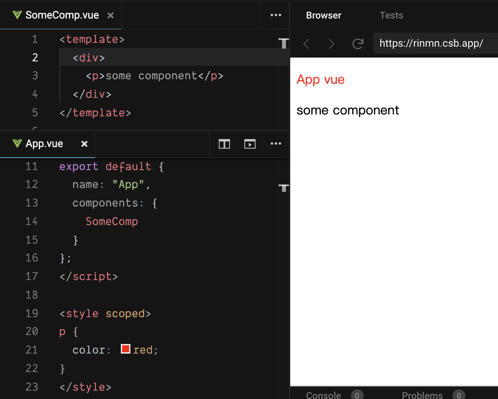

## 起因

有同事看到 Vue 專案裡的 css 有用到 `/deep/` 這個用法，大概是長下面這樣：

```jsx
// SomeComponent.vue

<template>
...
</template>

<style scoped>
	/deep/ .some-class {
		color: red;
	}
</style>
```

在 vue single file component 裡的 css，用到了 `/deep/` 這個語法。

他詢問我這是什麼意思，於是除了跟他大概講解以外、也嘗試記錄下來，如果你有興趣就繼續看下去吧

## 1. 首先要先知道 **scoped** 是幹嘛的

在 vue 的 single file component 裡，css 可以加上 scoped，讓該 css 只在該 component 裡有效。

這是避免假如在 component A 改某個 class 的 css，而剛好 component B 也有那個 class，就會造成「改 A 壞 B」的狀況

也可以看看下面影片的例子，在沒有 scoped 的情況下，B.vue 裡的 style 污染到了 A.vue，加了 scoped 後，就只會在 B.vue 生效。


## 2. **scoped** 是怎麼做到的


[官網](https://vue-loader.vuejs.org/guide/scoped-css.html#mixing-local-and-global-styles) 其實就有很好的解釋了，以下來自官網的範例：

這裡的 style 加了 scoped 後

```jsx
<style scoped>
.example {
  color: red;
}
</style>

<template>
  <div class="example">hi</div>
</template>
```

經過 [Vue Loader](https://vue-loader.vuejs.org/) 編譯後會變成下面這樣

```jsx
<style>
.example[data-v-f3f3eg9] {
  color: red;
}
</style>

<template>
  <div class="example" data-v-f3f3eg9>hi</div>
</template>
```

可以看到分別在 html 和 css 都加上了 **data attribute** ，所以其他 component 也有 example 這個 class 但因為沒 data attribute 就不會被污染

## 3. 為什麼 `scoped` 裡的 css ，child component 吃不到

狀況題：在 App.vue 裡引入了 SomeComp component，而在 App.vue 裡想要改變 SomeComp 裡的 p 的顏色，卻發現改不了（如下）

```html
<-- SomeComp.vue -->
<template>
  <div id="someComp">
		<p> Some component </p>
	</div>
</template>

<-- App.vue -->
<template>
	<div id="app">
		<p>App vue</p>
		<SomeComp>
	</div>
</template>

<style scoped>
	p {
		color: red;
	}
</style>
```

ps. 這個狀況題其實很常會在引用第三方套件時發生，因為我們沒辦法改第三方的 component，只能寫在自己的 component 裡想辦法控制別人



那，怎麼會這樣呢？

我們先試著把上面的 code 經過 Vue Loader 編譯出來會長這樣：

```html
<div data-v-7ba5bd90 id="app">
  <p data-v-7ba5bd90>App vue</p>
  <div data-v-7ba5bd90 id="someComp">
    <p>some component</p>
  </div>
</div>

<style>
  p[data-v-7ba5bd90] {
    color: red;
  }
</style>
```

可以看到 App.vue 的 html 都加上了 `data-v-7ba5bd90` data-attribute，而 SomeComp.vue 的最外層 div 也被加上相同的 `data-v-7ba5bd90` ，但 p 卻沒有，於是造成 SomeComp 裡的 p 吃不到 css 的問題。

如何解決？

也就是今天這篇文章要提到的 [Deep Selectors](https://vue-loader.vuejs.org/guide/scoped-css.html#deep-selectors) 了！

如果沒有 pre-processor 可以用 `>>>` 符號，箭頭前面放的是 child component 最外層的 class

```css
<style scoped>
#someComp >>> p {
  color: red;
}
</style>
```

編譯後，這樣就選到 p 了！

```css
#someComp[data-v-7ba5bd90] p {
  color: red;
}
```

如果是用 pre-processor 可以用 `/deep/` 或 `::v-deep`

```css
<style lang="scss" scoped>
/deep/ p {
  color: red;
}
</style>
```

## 其他要注意的是...？

1. 以瀏覽器 render 的速度來說，在 scoped css 中使用 `p { color: red }` 的會比 `.example { color: red }` 慢好幾倍，所以能用 class 或 ids 盡量用

2. 動態產生的 DOM 如 `v-html` 不會受 scoped css 影響
